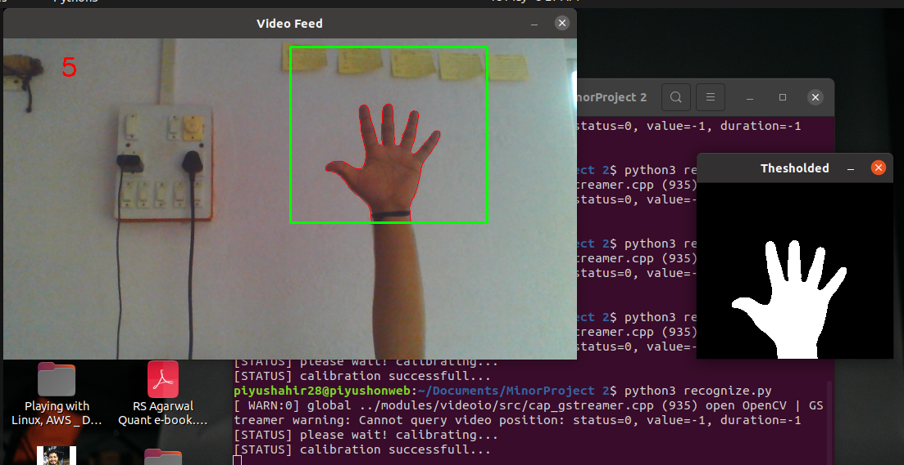

<h1 align="center">Hand Gesture Recognition</h1>

<p>
I am going to recognize hand gestures from a video sequence. To recognize these gestures from a live video sequence, we first need to take out the hand region alone removing all the unwanted portions in the video sequence. After segmenting the hand region, then count the fingers shown in the video sequence to instruct a robot based on the finger count. 
</p>

#### Libraries needed

* cv2
* imutils
* numpy
* sklearn



### Steps:

```bash
$ git clone https://github.com/piyushahir28/Hand-Gesture-Recognition.git
$ cd Hand-Gesture-Recognition
$ pip install -r requirements.txt
$ python recognize.py
```
